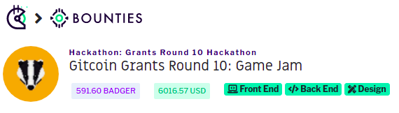

# BadgerFinance-Gitcoin-Dungeon-Hunt
<h1 align="center">BADGER DUNGEON HUNT</h1>

  
  <h6>Built at Gitcoin Grants Round 10: Game Jam by BadgerFinance</h6>
  
  

  
  
<a href="">Watch Demo Video on YouTube</a>

## 

    <a href="https://github.com/de-Dungeon-Crawler/BadgerFinance-Gitcoin-Dungeon-Hunt">View Docs</a>
    ·
    <a href="https://github.com/de-Dungeon-Crawler/BadgerFinance-Gitcoin-Dungeon-Hunt/issues">Report Bug</a>
    ·
    <a href="https://github.com/de-Dungeon-Crawler/BadgerFinance-Gitcoin-Dungeon-Hunt/issues">Request Feature</a>
  

##  Features

 ✔️ Deposit $BADGER to play the game. If you don't have badger, Swap Rinkeby $ETH with $BADGER from the ETH/BADGER swap.

 ✔️ Play the game to battle demons, monsters and guards and collect chests to claim our custom ERC-20 $BADGER token! Kill all enemies and Get to the token gate to collect a $LINK token and obtain the level pass to the next level 

 ✔️ Upon collecting the level pass, you are rewarded an NFT that is visible in the NFT Inventory  

 ✔️ Use the $BADGER tokens earned in the game to buy game items, portions, and weaponry from the BADGER SHOP. We are working on upgrading the avatar by equipping it with the purchased features  

 ✔️ New levels are being added and coming to the game soon! 

 ✔️ <b>Governance</b> using custom $BADGER token by rewarding game asset creators/artists for the open contribution inside the game in our DAO, coming soon! 

 
 **A lot more to come!**

## Architecture

### Built With
We have used the following technologies for this project:
* [Solidity](https://docs.soliditylang.org/en/v0.8.3/) (Language for writing smart contracts of the Dapp)
* [Chainlink](https://chain.link/) (Randomness generation for NFTs)
* [Filecoin](https://filecoin.io/) (NFT storage on Filecoin/IPFS)
* [Infura](https://infura.io/) (Connect to the blockchain and communication API)
* [Metamask](https://metamask.io) (Wallet Provider)
* [IPFS](https://orbitdb.org/) (https://ipfs.io/)
* [PhaserJS](https://phaser.io/) (Phaser is a 2D game framework used for making HTML5 games for desktop and mobile)
* [ReactJS](https://reactjs.org/) (web UI)

## Getting Started

* Clone the repo:
For the dApp
`https://github.com/de-Dungeon-Crawler/BadgerFinance-Gitcoin-Dungeon-Hunt && cd blockchain`

### Run the Project

Start the game
`https://github.com/de-Dungeon-Crawler/BadgerFinance-Gitcoin-Dungeon-Hunt && npm i && npm start`

For the dApp
`https://github.com/de-Dungeon-Crawler/BadgerFinance-Gitcoin-Dungeon-Hunt && cd blockchain && npm i && npm start`

Once you are in the project directory install the required dependencies using a package manager `yarn` or `npm`.

`yarn add` or `npm install`

`yarn start` or `npm start`

Runs the app in the development mode.
Open [http://localhost:3000](http://localhost:3000) to view it in the browser.
Open [http://localhost:8080](http://localhost:8080) to view it in the browser.

