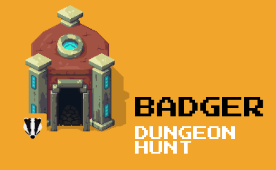

# BadgerFinance-Gitcoin-Dungeon-Hunt
<h1 align="center">BADGER DUNGEON HUNT</h1>

<p align="center">
  <a href="https://github.com/de-Dungeon-Crawler/BadgerFinance-Gitcoin-Dungeon-Hunt">
    
  </a>
  <h6>Built at Gitcoin Grants Round 10: Game Jam by BadgerFinance</h6>
  
  </p>
  
  <p align="center"><a href="https://www.youtube.com/watch?v=ysYjQYE15cw">Watch Demo Video on YouTube</a></p>

## 

<p align="center">
    <a href="https://github.com/de-Dungeon-Crawler/BadgerFinance-Gitcoin-Dungeon-Hunt">View Docs</a>
    ·
    <a href="https://github.com/de-Dungeon-Crawler/BadgerFinance-Gitcoin-Dungeon-Hunt/issues">Report Bug</a>
    ·
    <a href="https://github.com/de-Dungeon-Crawler/BadgerFinance-Gitcoin-Dungeon-Hunt/issues">Request Feature</a>
  </p>

## Summary
RPG game built with Phaser that works with Ethereum Rinkeby Blockchain using Smart contracts. Deposit $BADGER to play game by swapping $BADGER/$ETH . Kill all enemies guarding the chests and collect $BADGER from Chests and get to the $LINK token Gate to collect NFT as a level pass. Shop weaponry and armory at the Badger Store and equip your hero. Enjoy the season of the Badger! NEW LEVELS COMING SOON!

## Concept Art
BADGER DUNGEON HUNT WORKFLOW:


##  Game Rules

<p> ✔️ Deposit $BADGER to play the game. If you don't have badger, Swap Rinkeby $ETH with $BADGER from the ETH/BADGER swap.</p>
<p> ✔️ Play the game to battle demons, monsters and guards and collect chests to claim our custom ERC-20 $BADGER token! Kill all enemies and Get to the token gate to collect a $LINK token and obtain the level pass to the next level </p>
<p> ✔️ Upon collecting the level pass, you are rewarded an NFT that is visible in the NFT Inventory  </p>
<p> ✔️ Use the $BADGER tokens earned in the game to buy game items, portions, and weaponry from the BADGER SHOP. We are working on upgrading the avatar by equipping it with the purchased features  </p>
<p> ✔️ New levels are being added and coming to the game soon! </p>
<p> ✔️ <b>Governance</b> using custom $BADGER token by rewarding game asset creators/artists for the open contribution inside the game in our DAO, coming soon! </p>

## Objectives 
Defeat enemies, collect Collect $BADGER and Govern using $BADGER

## Key Features
Some features have been mentioned on under the rules. We are working on state/progress management and adding a DAO in game for governance in game

## Inspirations
Inspired by Dungeon Games played by most Geeks and gamers. We were also inspired by the idea that we could swap Rinkeby ETH for BADGER(governance token) using swap/DEX like 1INCH, Uniswap within the game. We aim to establish a DAO to govern the game, distribute rewards to contributors of the game like Artists/game creators using $BADGER
 
 **A lot more to come!**

## Screenshots


#### Swap Rinkeby $ETH for $BADGER

#### Shop and Upgrade portions, weapons, armory at DUNGEON BADGER STORE 

#### NFT INVENTORY

#### KILL the ENEMY

#### COLLECT $BADGER from the CHESTS IN GAME

#### GET TO THE LINK TOKEN GATE TO GET AN NFT LEVEL PASS


### Built With
We have used the following technologies for this project:
* [Solidity](https://docs.soliditylang.org/en/v0.8.3/) (Language for writing smart contracts of the Dapp)
* [Chainlink](https://chain.link/) (Randomness generation for NFTs)
* [Filecoin](https://filecoin.io/) (NFT storage on Filecoin/IPFS)
* [Infura](https://infura.io/) (Connect to the blockchain and communication API)
* [Metamask](https://metamask.io) (Wallet Provider)
* [IPFS](https://orbitdb.org/) (https://ipfs.io/)
* [PhaserJS](https://phaser.io/) (Phaser is a 2D game framework used for making HTML5 games for desktop and mobile)
* [ReactJS](https://reactjs.org/) (web UI)
* [OpenZeppelin Contracts](https://openzeppelin.com/contracts/) (OpenZeppelin ERC-20 and ERC-721 standards)

## Getting Started

* Clone the repo:
For the dApp
`https://github.com/de-Dungeon-Crawler/BadgerFinance-Gitcoin-Dungeon-Hunt && cd blockchain`


### Run the Project

Start the game
`https://github.com/de-Dungeon-Crawler/BadgerFinance-Gitcoin-Dungeon-Hunt && npm i && npm start`

For the dApp
`https://github.com/de-Dungeon-Crawler/BadgerFinance-Gitcoin-Dungeon-Hunt && cd blockchain && npm i && npm start`

 Enter your API in `.env` inside 
BadgerFinance-Gitcoin-Dungeon-Hunt/blockchain/ folder

   ```JS
   ETHERSCAN_API_KEY="Your ETHERSCAN API KEY"
   RPC_URL="https://rinkeby.infura.io/v3/{YOUR RINKEBY API KEY}"
   MNEMONIC="Seed phrase of your metamask wallet"
   SKIP_PREFLIGHT_CHECK=true
   PRIVATE_KEY="Enter exported private key of your ethereum wallet metamask"
   ```
   
   NOTE: **NEVER SHARE YOUR API KEYS AND PRIVATE KEYS**

Once you are in the project directory install the required dependencies using a package manager `yarn` or `npm`.

`yarn add` or `npm install`

`yarn start` or `npm start`

Runs the app in the development mode.
Open [http://localhost:3000](http://localhost:3000) to view it in the browser.
Open [http://localhost:8080](http://localhost:8080) to view it in the browser.


